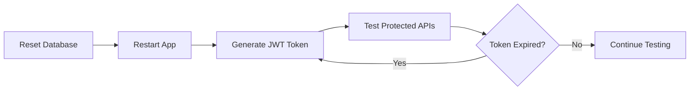

# 🚀 Next Steps After Database Reset

## ✅ What's Already Done

1. **✅ Security hardened** - Rolled back public catalogue access (now requires JWT)
2. **✅ JWT Authentication implemented** - Full JWT token generation and validation
3. **✅ Test auth endpoint created** - Easy token generation for API testing
4. **✅ Postman collection updated** - Auto-saves JWT tokens
5. **✅ Authentication guide created** - Complete testing documentation

---

## 📋 What You Need to Do Now

### Step 1: Reset the Database (MANUAL)

**Run these SQL commands in DBeaver or pgAdmin:**

```sql
-- Connect to 'postgres' database first, then run:

-- Terminate all connections
SELECT pg_terminate_backend(pid) 
FROM pg_stat_activity 
WHERE datname = 'ttelgo_dev' AND pid <> pg_backend_pid();

-- Drop and recreate database
DROP DATABASE IF EXISTS ttelgo_dev;
CREATE DATABASE ttelgo_dev;
```

### Step 2: Restart the Application

Once database is reset, the application will automatically:
- ✅ Create fresh schema using Hibernate (VARCHAR types instead of enums)
- ✅ Apply all migrations correctly
- ✅ Start successfully without errors

---

## 🧪 Testing the APIs

### Quick Start (3 steps):

#### 1. Import Postman Collection
- Open Postman
- Import `TTelGo_API_Collection.postman_collection.json`
- Import `TTelGo_API.postman_environment.json`
- Select "TTelGo Local" environment

#### 2. Generate JWT Token
- In Postman, open folder **🔐 Authentication**
- Run **"Generate Test JWT Token"**
- Token will **auto-save** to `{{jwt_token}}` variable
- ✅ All protected endpoints now work!

#### 3. Test Protected Endpoints
Now you can test any endpoint that was previously returning 403:

```
GET {{base_url}}/api/v1/catalogue/bundles
```

The JWT token is automatically included in the Authorization header!

---

## 📚 Key Documentation

| Document | Purpose |
|----------|---------|
| **`AUTHENTICATION_GUIDE.md`** | Complete JWT auth guide for testing |
| **`POSTMAN_IMPORT_GUIDE.md`** | How to import and use Postman collection |
| **`APPLICATION_RUNNING_SUMMARY.md`** | Full application overview |
| **`README.md`** | Main project documentation |

---

## 🔐 Understanding the Security Model

### Public Endpoints (No JWT Required)
```
✅ /api/auth/**                    - Authentication
✅ /api/webhooks/stripe/**         - Stripe webhooks
✅ /actuator/health/**             - Health checks
✅ /swagger-ui/**                  - API docs
```

### Protected Endpoints (JWT Required)
```
🔒 /api/v1/catalogue/**            - eSIM Bundles
🔒 /api/v1/orders/**               - Orders
🔒 /api/v1/esims/**                - eSIM lifecycle
🔒 /api/v1/payments/**             - Payments
🔒 /api/v1/vendor/**               - Vendor APIs
```

---

## 🎯 Testing Workflow



---

## ⚠️ Important Notes

### About the Test Authentication Endpoint

The `/api/auth/test/token` endpoint is:
- ✅ **Perfect for development** - Quick and easy token generation
- ✅ **Great for testing** - No need for user registration flow
- ❌ **NOT for production** - Must be removed or disabled before going live
- ❌ **Not secure** - Anyone can generate tokens

### Token Lifecycle
- **Access Token:** Valid for **24 hours**
- **Refresh Token:** Valid for **7 days**
- After expiration, simply generate a new token

---

## 🐛 Troubleshooting

### Issue: Application won't start after DB reset
**Solution:** Check terminal logs for migration errors. If present, ensure database is completely empty.

### Issue: Still getting 403 Forbidden
**Solution:** 
1. Verify JWT token is generated
2. Check token is saved to `{{jwt_token}}` variable in Postman
3. Ensure Authorization header is set correctly: `Bearer <token>`

### Issue: Token expired
**Solution:** Generate a new token using the `/api/auth/test/token` endpoint

---

## 📞 API Testing Checklist

- [ ] Database reset completed
- [ ] Application started successfully
- [ ] Postman collection imported
- [ ] Environment variables configured
- [ ] JWT token generated
- [ ] Health check endpoint working (`/actuator/health`)
- [ ] Catalogue endpoint working with JWT (`/api/v1/catalogue/bundles`)
- [ ] Ready for full API testing!

---

## 🎉 What's Next?

Once everything is working:

1. **Test all endpoints** using the Postman collection
2. **Verify eSIM Go integration** (bundles should load from real API)
3. **Test order creation flow** (end-to-end)
4. **Validate Stripe integration** (payment flows)
5. **Check vendor APIs** (B2B functionality)

---

**Ready to proceed! 🚀**

After you reset the database, just let me know and I'll help verify everything is working correctly!

